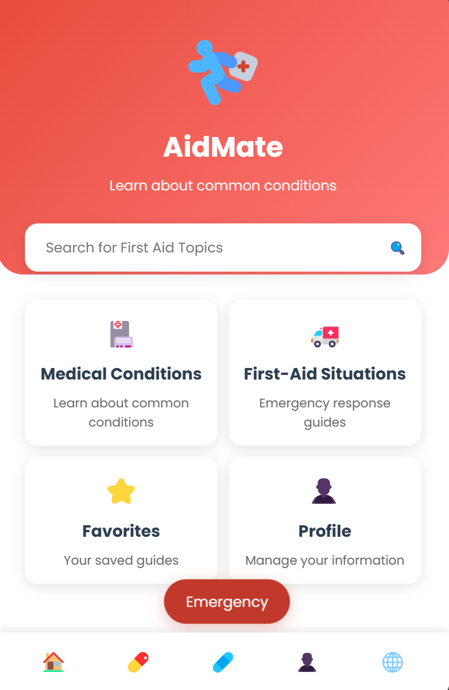
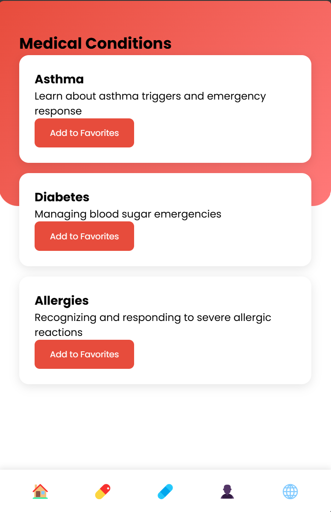
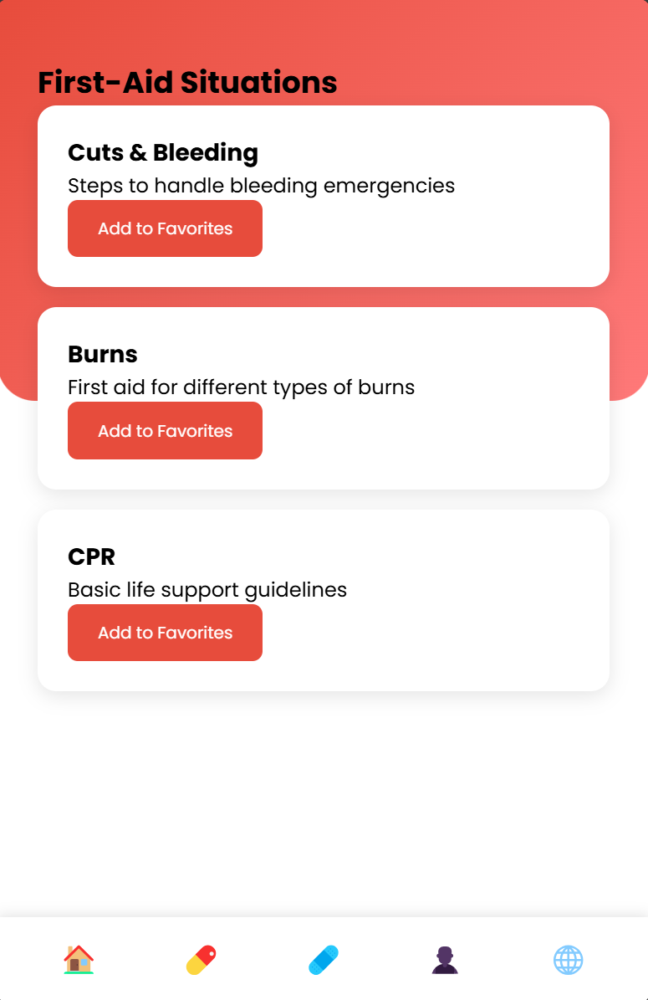
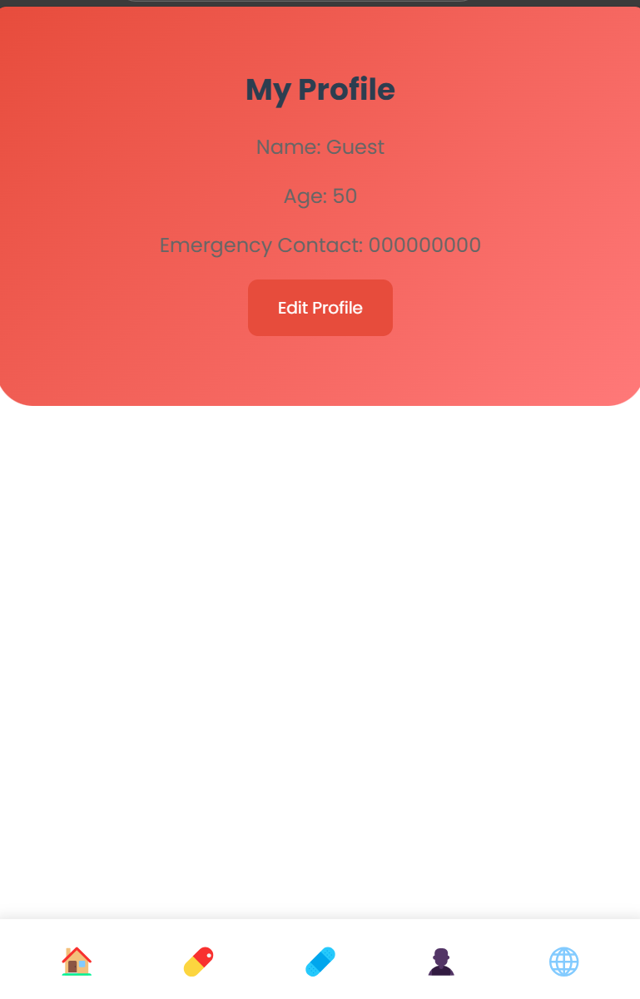

# AidMate - First Aid Assistant (Lab Activity)

**AidMate** is a web-based first aid assistant developed as part of the **CCS 112** lab activity under the **College of Computing Studies** at **Pamantasan ng Cabuyao**. This project is created by **3 IT - D** students to demonstrate the application of web development skills in creating a functional and user-friendly tool for first-aid assistance.

## Features

- **Dashboard**: Quick access to Medical Conditions, First-Aid Situations, Favorites, and Profile.
- **Medical Conditions**: Learn about common conditions like Asthma, Diabetes, and Allergies.
- **First-Aid Situations**: Guides for handling emergencies like cuts, burns, and CPR.
- **Favorites**: Save and manage your favorite guides.
- **Profile Management**: Update personal information and emergency contacts.
- **Emergency Contacts**: Quick access to emergency services.
- **Multi-language Support**: Available in English, Spanish, French, and German.
- **Search Functionality**: Easily search for first-aid topics.

## Technologies Used

- **HTML**, **CSS**, **JavaScript**
- **LocalStorage** for saving user data.
- **Font Awesome** for icons.
- **Google Fonts** for typography.

## How to Use

1. Open the `index.html` file in your browser.
2. Explore the dashboard to access medical conditions, first-aid situations, and profile settings.
3. Use the search bar to find specific topics.
4. Save your favorite guides for quick access.
5. Update your profile and emergency contact information.

## Purpose

This project is a **lab activity** for **CCS 112**, aimed at applying web development concepts to create a functional application. It demonstrates the use of HTML, CSS, and JavaScript to build an interactive and responsive web application.

---

## Screenshots

## Contributing

Contributions are welcome! If you'd like to contribute, please follow these steps:

1. Fork the repository.
2. Create a new branch for your feature or bug fix.
3. Commit your changes.
4. Submit a pull request.

## License

This project is licensed under the MIT License. See the [LICENSE](LICENSE) file for details.

## Acknowledgments

- **Font Awesome** for providing icons.
- **Google Fonts** for the Poppins font.
- **Open Source Community** for inspiration and support.

---

**Developed by:**  
**3 IT - D Students**  
**College of Computing Studies**  
**Pamantasan ng Cabuyao**  
**CCS 112 Lab Activity**
